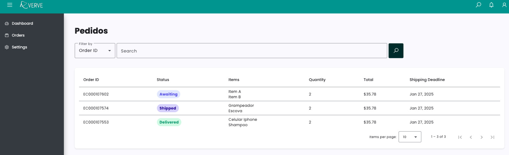

# Verve



## Overview
This project is an ERP management system that integrates with multiple marketplaces, including **Tiendamiaus** and **Worten** (both using Mirakl). The system provides functionalities to:

- Fetch orders from the marketplaces
- Process and store orders in the database
- Update order statuses via API
- Manage customers, shipping, and products
- Use Celery for background tasks
- Provide a frontend dashboard built with Angular

## Tech Stack
- **Backend:** Python (Django, FastAPI)
- **Database:** MySQL
- **Task Queue:** Celery
- **Message Broker:** Redis
- **Frontend:** Angular
- **Containerization:** Docker & Docker Compose

## Setting Up the Project

### Prerequisites
Ensure you have the following installed:
- Docker & Docker Compose
- Python 3.8+
- MySQL
- Redis
- Node.js & npm (for Angular frontend)

### Running with Docker
1. Copy the `.env.example` file to `.env` and configure environment variables.
2. Run the following command to start the services:
```bash
docker-compose up --build
```
3. The backend application will be available at `http://localhost:8000`.

### Running Celery Worker
To process background tasks, run:
```bash
docker-compose run --rm celery
```

### Running the Angular Frontend
1. Navigate to the frontend directory:
```bash
cd src/frontend
```
2. Install dependencies:
```bash
npm install
```
3. Start the development server:
```bash
ng serve --open
```
4. The frontend will be available at `http://localhost:4200`.

## Integrations
### 1. Fetching Orders
Orders are fetched from **Tiendamiaus** and **Worten** APIs using Celery.

```python
from celery import shared_task
from src.tiendamiaus.services.tiendamiaus_service import TiendamiausService
from src.worten.services.worten_service import WortenService
import logging

@shared_task
def import_orders():
    logging.info("Importing orders...")
    TiendamiausService().get_orders()
    WortenService().get_orders()
    return "Orders imported successfully!"
```

### 2. Updating Orders
To update order statuses, the system sends a **PUT** request to the API endpoint of the respective marketplace.

Example API call:
```bash
curl --location --request PUT 'https://tiendamiaus-prod.mirakl.net/api/orders' \
--header 'Authorization: YOUR_API_KEY' \
--header 'Content-Type: application/json' \
--data-raw '{ "orders": [ { "order_id": "Order_00014", ... } ] }'
```

### 3. Mapping Fields
Each integration has its own field mappings defined in the `mapping.py` file.
```python
MAPPING = {
    "worten": {
        "order_id": "integrationorderid",
        "commercial_id": "title",
        "order_state": "integrationstatus",
        "currency_iso_code": "currency",
        "total_price": "totalprice",
        "order_lines.product_sku": "sku",
        "order_lines.product_title": "title",
    }
}
```

## Environment Variables (.env)
```env
DB_NAME=your_db
DB_USER=your_user
DB_PASSWORD=your_password
DB_ROOT_PASSWORD=your_root_password
REDIS_URL=redis://redis:6379/0
```

## Contributors
- **Rute Cintra** - Developer
- **Renan Kusmin** - Developer

## License
This project is open-source and available under the [MIT License](LICENSE).